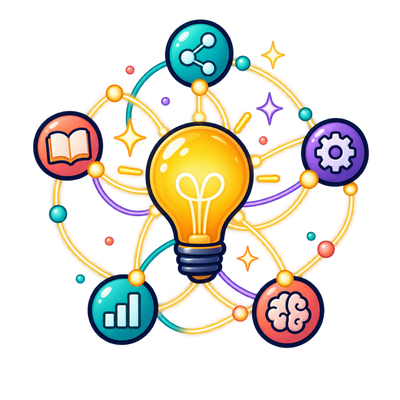

# Insights introduction



```admonish tip title="Related"
The Semantic View: [Why meaning comes first](../denotational-design/semantic-view.md)  
Design by Meaning in Rust: [Capability algebras](../rust-dd/capability-algebras.md)  
Concepts: [Introduction](../concepts/index.md)
```

Insights connect the programming concepts to one another and to practical designs.

They are best read after [The Semantic View](../denotational-design/semantic-view.md) and [Design by Meaning in Rust](../rust-dd/capability-algebras.md). That foundation prevents a useful encoding from being mistaken for the definition of meaning.

The recurring distinction is:

1. Begin with the semantic specification.
2. Choose a representation or transformation.
3. Supply an operational interpretation.

An insight may cross all three layers. When it does, ask where each claim belongs and which law connects the layers.
