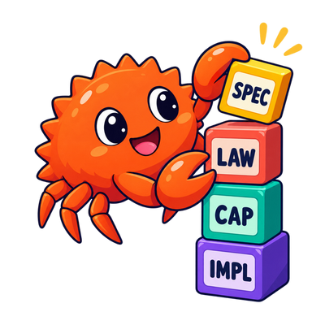

# Capability algebras



```admonish tip title="Related"
The Semantic View: [Denotational Design](../denotational-design/design.md), [Denotations and compositionality](../denotational-design/denotations.md)  
Design by Meaning in Rust: [Semantic types in Rust](semantic-types.md), [Derived meaning and composition](derived-meaning.md)  
Concepts: [Expression Problem](../concepts/expression-problem.md), [Branching and confluence](../concepts/branching.md)
```

```admonish note title="Orientation"
A capability trait is a small algebra: it names the primitive observations and transformations a meaning requires and leaves representation to the interpreter. Design the vocabulary from meaning, not from the fields a first implementation happens to hold.
```

Rust does not have a built-in construct called “Denotational Design.” We encode semantic vocabularies with ordinary language features. Small capability traits are one useful encoding.

The suffix `Alg` in this book means **algebra**: a coherent set of primitive operations over interpreter-chosen carriers.

## Start from meaning

The branch-position meaning from the previous part can be expressed as:

```rust,noplayground
#[derive(Clone, Copy, Debug, PartialEq, Eq)]
pub enum Direction {
    Left,
    Right,
}

pub trait BranchAlg {
    type Branch;

    fn branch_root(&self) -> Self::Branch;
    fn branch_grow(&self, branch: &Self::Branch, direction: Direction) -> Self::Branch;
    fn branch_path(&self, ancestor: &Self::Branch, descendant: &Self::Branch) -> Option<Vec<Direction>>;
}
```

The trait states three primitive meanings:

* construct the root
* grow a branch in one direction
* observe the relative path when it exists

It does not reveal where branches are stored or how paths are encoded.

## Capabilities are not field projections

````admonish warning title="Field projections are not semantic capabilities"
Compare:

```rust,noplayground
trait BranchContext {
    fn branches(&self) -> &Vec<Vec<bool>>;
    fn branches_mut(&mut self) -> &mut Vec<Vec<bool>>;
}
```

This trait hides a struct behind methods but still exposes its representation. Any derived logic becomes coupled to vectors, booleans, ownership, and mutation strategy.
````

A semantic capability exposes the observation or transformation downstream meaning requires. Ask:

```admonish question title="Ask of every capability"
If the implementation used a database, symbolic term, compact integer, or remote service, would this operation still make sense?
```

If yes, the operation may belong in the capability. If callers need the current field layout, it probably does not.

## One primitive meaning per trait

Small traits make dependencies visible:

```rust,noplayground
pub trait ClockAlg {
    type Instant;

    fn clock_now(&self) -> Self::Instant;
}

pub trait DeadlineAlg<Instant> {
    fn deadline_expired(&self, now: &Instant) -> bool;
}
```

A derived operation that needs time and a deadline can require both traits. It does not need an `ApplicationContext` containing logging, storage, networking, configuration, and scheduling.

“Small” does not mean one method mechanically. Group operations when they form one inseparable semantic structure. Split them when they express independent meanings or admit independent interpreters.

## Associated types select carriers

Use associated types when the interpreter chooses representation:

```rust,noplayground
pub trait SourceAlg {
    type Source;
    type Error;

    fn source_read(&self, name: &str) -> Result<Self::Source, Self::Error>;
}
```

Do not require `String`, `std::io::Error`, or a concrete syntax tree unless those are stable semantic vocabulary at this boundary.

Conversely, concrete semantic values are welcome:

```rust,noplayground
pub enum Severity {
    Warning,
    Error,
}
```

The rule is not “make every type abstract.” The rule is “do not confuse interpreter machinery with semantic vocabulary.”

## Put bounds where they are used

Keep a primitive free of constraints it does not need:

```rust,noplayground
pub trait CandidateAlg {
    type Candidate;

    fn candidates(&self) -> impl Iterator<Item = Self::Candidate>;
}
```

````admonish warning title="Do not add preemptive bounds"
Do not constrain the associated type merely because one future algorithm might need it:

```rust,noplayground
pub trait CandidateAlg {
    // not recommended: every interpreter now pays for bounds
    // most operations never use
    type Candidate: Clone + Ord + Hash + Send + Sync;

    fn candidates(&self) -> impl Iterator<Item = Self::Candidate>;
}
```

The operation that sorts candidates can require `Ord`; the operation that places them in a hash set can require `Hash`.
````

Use-site bounds keep primitive meanings reusable and reveal the real contract of derived behavior.

## Effects can be primitive meaning

Capability traits do not imply pure execution:

```rust,noplayground
pub trait PublishAlg {
    type Document;
    type Error;

    async fn publish(&self, document: Self::Document) -> Result<(), Self::Error>;
}
```

Publishing is an effect. It may still be a primitive semantic operation at the current boundary. The concrete interpreter may use HTTP, a queue, a file, or a test buffer.

The semantic layer should not prescribe retries, socket ownership, task spawning, or connection pools unless those distinctions are part of the intended meaning.

## Naming the boundary

Capabilities should be phrased from the consumer's semantic perspective:

| Meaning-oriented | Representation-oriented |
| --- | --- |
| `closed_outcome(slot)` | `get_runtime_map(slot)` |
| `source_read(name)` | `compiler_context().sources().lookup(name)` |
| `branch_path(ancestor, descendant)` | `raw_branch_bits(id)` |

Naming is design. A mechanical name invites mechanical coupling.

## Review checks

* Does the trait expose one coherent primitive meaning?
* Could an independent interpreter implement it without copying the first representation?
* Are associated types abstract only where the interpreter genuinely chooses?
* Are concrete types stable semantic vocabulary?
* Are bounds absent until an operation uses them?
* Does the trait avoid returning managers, contexts, and raw storage?
